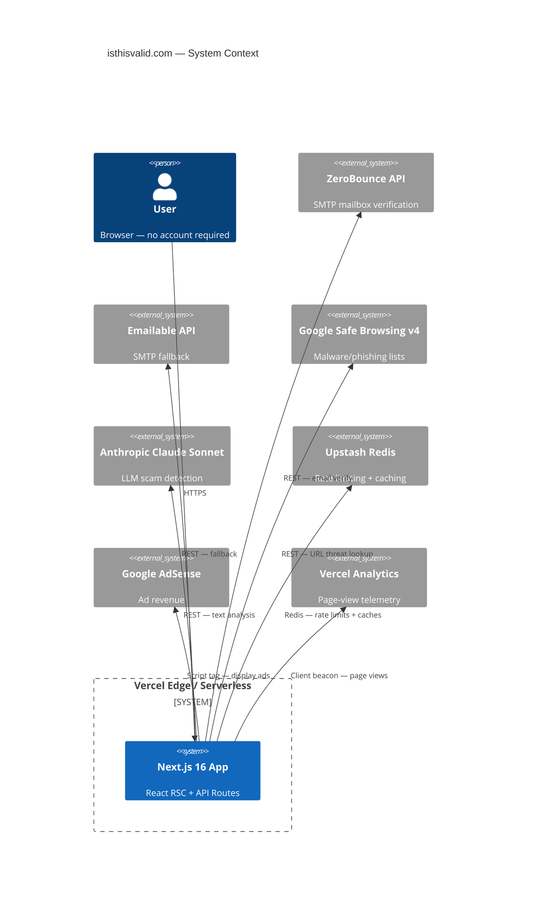
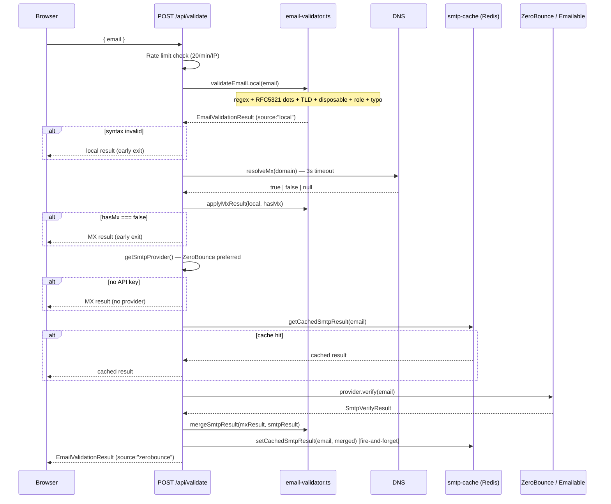
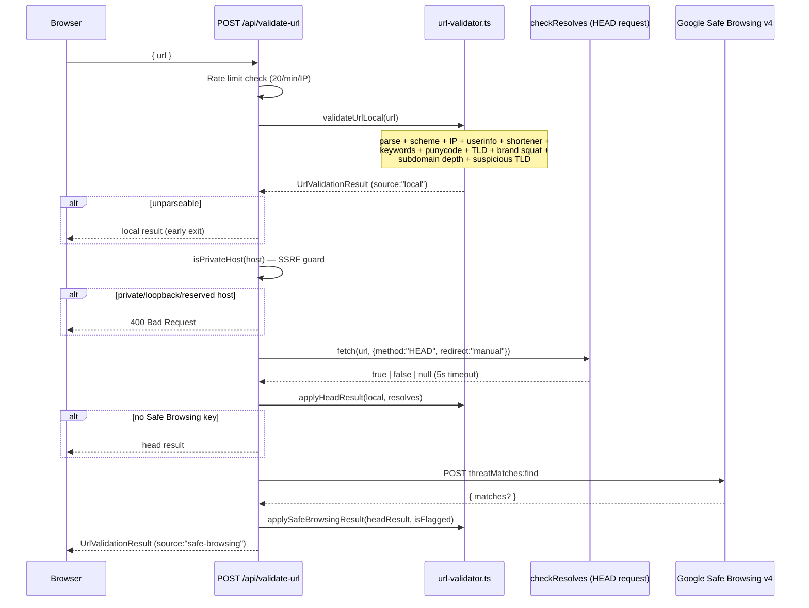
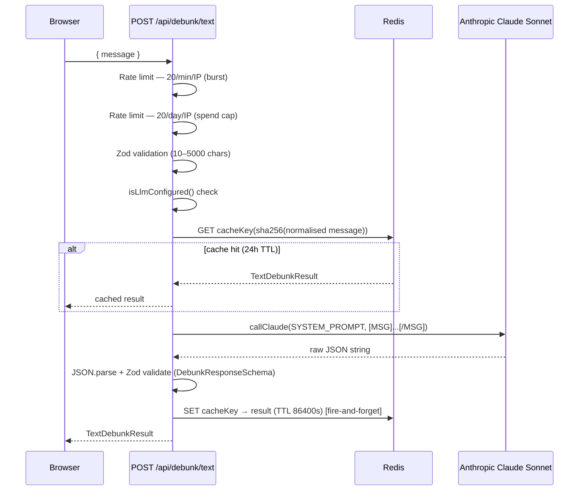

# isthisvalid.com — Maintenance-Grade Technical Documentation

**Generated:** February 27, 2026 | **Build:** ✅ clean (16 routes) | **Tests:** ✅ 290/290 | **Branch:** `main`

---

## 1. Project Overview

### Purpose & Business Value

isthisvalid.com is a free, no-signup, multi-tool verification hub that lets any member of the public instantly check whether an email address is real, a URL is safe, or a text message is a scam. The business model is Google AdSense advertising plus contextual affiliate links (ZeroBounce for email verification, NordVPN for URL safety). Hosted on Vercel; all computation happens in serverless API routes. Zero user accounts, zero persistent PII.

### High-Level Architecture



### Core Design Patterns & Rationale

| Pattern                             | Where                                                                            | Why                                                                                                                               |
| ----------------------------------- | -------------------------------------------------------------------------------- | --------------------------------------------------------------------------------------------------------------------------------- |
| **Pipeline / merge pattern**        | email-validator, url-validator                                                   | Cheap local checks first, progressive enrichment with paid APIs. Early exits avoid burning paid credits.                          |
| **Pluggable provider abstraction**  | smtp-provider.ts                                                                 | Swap ZeroBounce ↔ Emailable by setting/unsetting env vars — no code changes.                                                      |
| **Progressive scoring (0–100)**     | Both validators                                                                  | Single number powers UI ring + `safe`/`valid` verdict. Caps and floors encode business rules (e.g. `apiDeliverable=false` → ≤10). |
| **Graceful no-op when keys absent** | rate-limit, llm-client, smtp-cache, smtp-provider                                | Entire tool still works in local dev with zero env vars.                                                                          |
| **Result-merge functions**          | `applyMxResult`, `mergeSmtpResult`, `applyHeadResult`, `applySafeBrowsingResult` | Each async check returns an enriched copy — no mutation, easy to test in isolation.                                               |
| **SHA-256 cache keying**            | smtp-cache, text route                                                           | PII-safe: the raw email/text is never stored in Redis.                                                                            |
| **Layout-scoped JSON-LD**           | Each tool's `layout.tsx`                                                         | FAQPage structured data must appear only on the relevant page. Root layout carries only the site-level `WebApplication` schema.   |
| **Server Components by default**    | All UI except forms                                                              | Reduces JS bundle; forms that need `useState` are narrow Client Components.                                                       |

### Tech Stack

| Technology               | Version | Role                                                         |
| ------------------------ | ------- | ------------------------------------------------------------ |
| Next.js                  | 16.1.6  | Framework — App Router, RSC, API routes, static generation   |
| React                    | 19.2.3  | UI                                                           |
| TypeScript               | ^5      | Language — strict mode throughout                            |
| Tailwind CSS             | v4      | Styling — always-dark, utility-first                         |
| Zod                      | v4.3.6  | Runtime request validation (`z.object`, `safeParse`)         |
| @upstash/ratelimit       | 2.0.8   | Serverless rate limiting                                     |
| @upstash/redis           | 1.36.2  | Redis client (REST-based, works in Edge/serverless)          |
| @anthropic-ai/sdk        | 0.78.0  | Claude API wrapper                                           |
| disposable-email-domains | 1.0.62  | 57,000+ disposable domain list                               |
| mailchecker              | 6.0.19  | Additional disposable domain coverage (merged at build time) |
| Jest + ts-jest           | 30.x    | Unit testing                                                 |

---

## 2. Local Development Setup

### Prerequisites

- Node.js ≥ 20 (LTS recommended)
- npm ≥ 10

### Step-by-Step

```bash
# 1. Clone
git clone https://github.com/msywensky/isthisvalid.git
cd isthisvalid

# 2. Install dependencies
npm install

# 3. Configure environment
cp .env.example .env.local
# Fill in at minimum ANTHROPIC_API_KEY if you want the text tool to work.
# Leave all other keys blank to use local-only checks (still fully functional).

# 4. Run development server
npm run dev
# → http://localhost:3000

# 5. Run tests
npm test

# 6. Production build (TypeScript type-check + static generation)
npm run build
```

### Environment Variables

| Variable                               | Required?                   | Default / Fallback            | Notes                                        |
| -------------------------------------- | --------------------------- | ----------------------------- | -------------------------------------------- |
| `ANTHROPIC_API_KEY`                    | For text tool               | Tool returns error if absent  | Set spend cap in Anthropic console first     |
| `ZEROBOUNCE_API_KEY`                   | Preferred SMTP              | Local+MX only if absent       | 100 free verifications/month                 |
| `EMAILABLE_API_KEY`                    | SMTP fallback               | Ignored if ZeroBounce present | 250 one-time free                            |
| `UPSTASH_REDIS_REST_URL`               | For rate limiting + caching | No-op if absent               | Create at [upstash.com](https://upstash.com) |
| `UPSTASH_REDIS_REST_TOKEN`             | For rate limiting + caching | No-op if absent               | Paired with URL above                        |
| `GOOGLE_SAFE_BROWSING_API_KEY`         | For URL threat check        | Skipped if absent             | 10,000 req/day free                          |
| `NEXT_PUBLIC_ADSENSE_ID`               | For ad revenue              | Ads hidden if blank           | Leave blank until AdSense approved           |
| `NEXT_PUBLIC_ZEROBOUNCE_AFFILIATE_URL` | For affiliate nudge         | Placeholder shown             | Set when affiliate link obtained             |
| `NEXT_PUBLIC_NORDVPN_AFFILIATE_URL`    | For affiliate nudge         | Placeholder shown             | Set when affiliate link obtained             |

### Commands

```bash
npm run dev            # Dev server with hot reload
npm run build          # Production build (also type-checks)
npm run start          # Serve the production build locally
npm run lint           # ESLint
npm test               # Jest — all suites
npm run test:watch     # Jest in watch mode
npm run test:coverage  # Jest with lcov coverage report (→ coverage/)
npm run generate-og    # Regenerate OG image (scripts/generate-og.mjs)
```

### Common Gotchas

1. **Zod v4 breaking change**: Use `.issues` not `.errors` on `ZodError`. `.errors` is silently `undefined` at runtime.
2. **`disposable-email-domains` is a CommonJS ESM hybrid** — it exports an array, not a Set. `disposable-domains.ts` wraps it into a `Set` at module load time. Don't import it directly from API routes.
3. **`npm run build` is the source of truth for TypeScript errors.** The dev server may not surface all type errors. Always run before declaring production-ready.
4. **CRLF on Windows** — Git normalises line endings. The `privacy/page.tsx` CRLF warning on `git status` after editing is cosmetic; it resolves on the next Git touch.
5. **Redis is optional globally** — any code path that calls `getRedis()` must handle `null`. Every consumer (`smtp-cache`, `rate-limit`, text cache) already does this.

---

## 3. Architecture & Data Flow

### Route Map

```
/                  → app/page.tsx             Hub — 4 tool cards (SSG)
/check/email       → check/email/page.tsx     Email tool (SSG shell, CSR form)
/check/url         → check/url/page.tsx       URL tool (SSG shell, CSR form)
/check/text        → check/text/page.tsx      Text tool (SSG shell, CSR form)
/check/image       → check/image/page.tsx     Beta stub (SSG, no API)
/about             → about/page.tsx           (SSG)
/privacy           → privacy/page.tsx         (SSG)
/terms             → terms/page.tsx           (SSG)
/api/validate      → POST — email validation pipeline
/api/validate-url  → POST — URL validation pipeline
/api/debunk/text   → POST — text/SMS scam analysis
/sitemap.xml       → sitemap.ts               (SSG)
/robots.txt        → robots.ts                (SSG)
```

### Email Validation Data Flow



### URL Validation Data Flow



### Text/SMS Data Flow



---

## 4. Key Modules & Critical Code Walkthrough

### `src/lib/email-validator.ts`

**Responsibility:** Pure, synchronous local email analysis. No network calls. The only exported functions used externally are `validateEmailLocal`, `applyMxResult`, `mergeSmtpResult`.

**Public API:**

```typescript
validateEmailLocal(rawEmail: string): EmailValidationResult
applyMxResult(local: EmailValidationResult, hasMx: boolean | null): EmailValidationResult
mergeSmtpResult(local: EmailValidationResult, smtp: SmtpVerifyResult): EmailValidationResult
mergeEmailableResult(...)   // @deprecated — thin shim over mergeSmtpResult; keep for test compat
```

**Scoring system** (`computeScore`):

```
syntax        +40   (mandatory for any meaningful score)
validTld      +15
notDisposable +25
notRole       +10
hasMx=true    → min(score+5, 100)    small bonus, not decisive
hasMx=false   → min(score, 15)       hard cap — domain can't receive mail
apiDeliverable=true  → min(score+10, 100)   lifts cap
apiDeliverable=false → min(score, 10)        below hasMx=false cap (stronger signal)
```

**Critical invariant — the typo cap:** When `suggestion` is set (domain is a known typo), the score is capped at ≤65 in `validateEmailLocal`, re-enforced in `applyMxResult`, and only lifted in `mergeSmtpResult` when `apiDeliverable === true`. `hasMx === true` alone is NOT sufficient to lift the cap — a typo domain could still own MX records. This was Bug 5 from the Feb 26 session.

**Critical invariant — `mergeSmtpResult` valid formula:**

```typescript
valid =
  local.checks.syntax &&
  local.checks.validTld && // ← Bug 3 fix: must check this too
  checks.notDisposable &&
  local.checks.hasMx !== false &&
  (smtp.deliverable === true || (!smtp.undeliverable && local.valid));
```

If `smtp.deliverable === true` short-circuits, `validTld` must still be checked independently — otherwise a malformed domain can emerge as `valid: true`.

**Non-obvious decisions:**

- `void email` in `buildMessage` — the parameter is unused by design (messages are generic, not personalised). Suppressed to keep TypeScript strict happy.
- `buildMessage`'s `validTld` branch is technically dead code — the regex already rejects bad TLDs. It exists as a safety net for future regex relaxation. Do not delete.
- Role addresses are `valid: true` — role inboxes _can_ receive mail; they're penalised via score (80/100) and a flagged message, not hard-rejected. This is intentional.

---

### `src/lib/url-validator.ts`

**Responsibility:** Local URL analysis + merge helpers for HEAD and Safe Browsing results.

**Public API:**

```typescript
validateUrlLocal(rawUrl: string): UrlValidationResult
applyHeadResult(result: UrlValidationResult, resolves: boolean | null): UrlValidationResult
applySafeBrowsingResult(result: UrlValidationResult, isFlagged: boolean): UrlValidationResult
/** @internal */ getRegisteredDomain(hostname: string): string   // eTLD+1 extractor (CCTLD_SECOND_LEVELS-aware)
/** @internal */ checkBrandSquat(hostname: string): boolean       // brand squat detector; exported for testability
```

**Check priority order (scoring & message precedence):**

```
safeBrowsing=false             → score ≤5, safe=false  (nuclear override)
noBrandSquat=false             → score -15
notExcessiveSubdomains=false   → score cap ≤60
notSuspiciousTld=false         → score cap ≤80
notIpAddress=false             → score -15
noUserInfo=false               → score -10
notShortener=false             → score -10
noSuspiciousKeywords=false     → score -20
notPunycode=false              → score -10
validTld=false                 → score -10
validScheme=false              → score -10
resolves=false                 → score cap ≤70
resolves=true                  → score +5
```

**`getRegisteredDomain` is a simplified eTLD+1 extractor** (last two labels). It does not use a public suffix list. This means `paypal.com.uk` would be treated as `com.uk` — a known limitation. Good enough for MVP brand squatting checks but would need a proper PSL library (e.g. `tldts`) for full accuracy.

**Subdomain depth threshold:** ≥5 labels. `www.example.com` (3) and `api.shop.example.com` (4) pass cleanly. `paypal.com.secure.verify.evil.com` (6) is flagged. The `safe` check in `applyHeadResult` also enforces `notExcessiveSubdomains` — a URL cannot be `safe=true` with excessive subdomain depth regardless of score.

**Suspicious TLD list rationale:** Drawn from ICANN abuse statistics and threat intelligence data. These are _risk signals_, not hard fails — legitimate services exist on these TLDs. The cap at ≤80 prevents a `score=100` clean verdict but does not auto-flag as unsafe.

**Safe Browsing API version note:** The code uses **v4 (JSON REST)**. v5 returns protobuf by default and does not support clean JSON output with the same key. Do not upgrade to v5 without refactoring the parser. The route is correctly commented with the v4 lookup API URL. Verify it links to `https://developers.google.com/safe-browsing/v4/lookup-api` before any Safe Browsing refactor.

---

### `src/lib/smtp-cache.ts`

**Responsibility:** Redis-backed cache for SMTP provider results to avoid burning paid API credits on repeated lookups.

**Key design:**

- Cache key: `itv:smtp:{sha256(lowercase(email))}` — the raw email is never stored in Redis keys
- TTL: 604,800 seconds (7 days)
- Only caches results with `source !== "local"` — local-only results have no SMTP data worth caching
- Fully no-op when Redis is unavailable — callers receive `null` on miss

**Usage in `validate/route.ts`:**

```typescript
const cached = await getCachedSmtpResult(email);
if (cached) return NextResponse.json(cached);

const merged = mergeSmtpResult(resultWithMx, smtpResult);
void setCachedSmtpResult(email, merged); // fire-and-forget
```

`setCachedSmtpResult` must never be `await`ed in the hot path — it adds ~50ms latency for no user benefit.

---

### `src/lib/smtp-provider.ts`

**Responsibility:** Provider abstraction so ZeroBounce and Emailable are interchangeable.

**Factory function:**

```typescript
export function getSmtpProvider(): SmtpProvider | null {
  if (ZEROBOUNCE_API_KEY) return new ZeroBounceProvider(key);
  if (EMAILABLE_API_KEY) return new EmailableProvider(key);
  return null;
}
```

ZeroBounce is always preferred when both keys are present. To force Emailable, unset `ZEROBOUNCE_API_KEY`.

**Normalised result:** Both providers return `SmtpVerifyResult` with the same three boolean flags — callers never know which provider ran.

**ZeroBounce `deliverable` mapping:**

```
status="valid"    → deliverable=true
status="invalid"  → undeliverable=true
catch-all/unknown → deliverable=null, undeliverable=false
```

`null` deliverable means "we know the domain exists but can't confirm the mailbox" — the validator treats this as an uncertain signal, not a failure.

---

### `src/lib/rate-limit.ts`

**Responsibility:** Upstash-backed rate limiting for all API routes. Also exports `getRedis()` — the shared Redis client used by `smtp-cache` and the text route cache.

**Limiters:**

| Limiter             | Algorithm      | Limit         | Used by                                                  |
| ------------------- | -------------- | ------------- | -------------------------------------------------------- |
| `_limiter`          | Sliding window | 20 req/min/IP | `/api/validate`, `/api/validate-url`, `/api/debunk/text` |
| `_dailyTextLimiter` | Fixed window   | 20 req/day/IP | `/api/debunk/text` only                                  |

**Key prefixes:** `itv:rl:{ip}` for per-minute; `itv:daily:text:{ip}` for per-day.

**Shared key space:** The per-minute limiter is shared across all three tools. 20 requests/minute covers combined tool usage per IP — intentional to simplify management.

---

### `src/lib/llm-client.ts`

**Responsibility:** Thin singleton wrapper around the Anthropic SDK.

**Model pin:** `claude-sonnet-4-20250514`. To upgrade, change this constant. Always re-run text tests after a model upgrade — output format can subtly change.

**`callClaude` returns `null` when unconfigured** — the text route handles this with an error response. Never throws for "no key" — only for API/network failures.

---

### `src/app/api/debunk/text/route.ts`

**Responsibility:** Text/SMS scam detection API. The most operationally expensive route (LLM calls).

**Prompt injection hardening:** User content is wrapped in `[MSG]...[/MSG]` delimiters. The system prompt explicitly instructs Claude to ignore instructions inside those delimiters. If injection is detected, classify as `suspicious` or `scam`.

**Cache normalisation:** The cache key hashes `lowercase + whitespace-collapsed` text. "FREE PRIZE!!!" and "free prize!!!" map to the same key — important for viral scam messages copied with minor formatting differences.

**Zod validation of Claude's response:** Claude's JSON output is validated against `DebunkResponseSchema`. If Claude returns malformed JSON or missing fields, the route returns 502. This prevents schema drift from silently serving bad data to the UI.

> ⚠️ **Spend cap reminder:** The Anthropic console spend cap is the _only_ hard stop on LLM costs. The per-day Redis rate limit (20/IP) reduces exposure but rotating IPs can bypass it. Set the cap in the Anthropic console before going viral.

---

### `src/app/layout.tsx`

**Responsibility:** Root layout — fonts, global metadata, `WebApplication` JSON-LD, AdSense script, Vercel Analytics, cookie consent.

**AdSense script is conditionally injected** — if `NEXT_PUBLIC_ADSENSE_ID` is blank, no script tag is emitted. This matters during the AdSense review period.

**CSP is set in `next.config.ts`** (as `headers()`), not in the layout. The layout only controls the visible HTML shell.

---

### `src/components/CheckShell.tsx`

**Responsibility:** Shared page wrapper for all `/check/*` tool pages. Server component — no state, no client bundle. Provides: breadcrumb nav, centred logo, tool hero section.

---

## 5. Maintenance & Operations Guide

### How to Add a New Tool

1. Create `src/app/check/{tool}/layout.tsx` with `FAQPage` JSON-LD and tool-specific metadata.
2. Create `src/app/check/{tool}/page.tsx` with `CheckShell` wrapping the tool's form component.
3. Create `src/app/api/{tool}/route.ts` with the validation pipeline (rate limit → validate → respond).
4. Create `src/lib/{tool}-validator.ts` with pure synchronous logic + merge helpers.
5. Create result type in a shared types file (or alongside the validator).
6. Create `src/components/{Tool}ResultCard.tsx` for the result UI.
7. Add the tool card to `src/app/page.tsx`'s `tools` array.
8. Add `__tests__/{tool}-validator.test.ts` with at minimum one test per exported function.
9. Run `npm run build` — verify route count increases by 2 (static page + API route).

### How to Fix Bugs

**Debugging validator scoring bugs:**

```typescript
// In any test file or quick script:
import {
  validateEmailLocal,
  applyMxResult,
  mergeSmtpResult,
} from "@/lib/email-validator";
const r1 = validateEmailLocal("user@gmail.con");
const r2 = applyMxResult(r1, true);
// inspect r2.score, r2.checks, r2.suggestion at each stage
```

Each pipeline stage returns an immutable snapshot — you can log any intermediate result independently.

**Common failure modes:**

| Symptom                                        | Likely cause                                                                         |
| ---------------------------------------------- | ------------------------------------------------------------------------------------ |
| Score is 100 for an address with a `.con` typo | Typo cap escaped in `applyMxResult` or `mergeSmtpResult`                             |
| `valid: true` on an address with a garbage TLD | `validTld` missing from `mergeSmtpResult`'s valid formula                            |
| Text tool returns 502                          | Claude returned malformed JSON — check `DebunkResponseSchema` against model response |
| Text tool returns "not configured"             | `ANTHROPIC_API_KEY` missing or blank in env                                          |
| Rate limit fires in local dev                  | `UPSTASH_REDIS_*` vars set — either clear them or use a dev Redis DB                 |
| SMTP cache never hits                          | Email normalisation mismatch, Redis TTL expired, or `result.source === "local"`      |
| Safe Browsing returns 401                      | API key not enabled for "Safe Browsing API" in Google Cloud Console                  |

### Testing Strategy

All tests live in `__tests__/` and are pure unit tests — no network, no Redis, no filesystem. External dependencies are mocked via Jest (`jest.mock`).

**Current suite:**

| File                        | Tests | Pattern                                                                                                                          |
| --------------------------- | ----- | -------------------------------------------------------------------------------------------------------------------------------- |
| `email-validator.test.ts`   | 150   | One `describe` per validator concept; explicit bug-regression suites labelled `[Bug N regression]`                               |
| `url-validator.test.ts`     | 80    | One `describe` per check; one per merge helper; dedicated suites for `getRegisteredDomain`, `checkBrandSquat`, and IP edge cases |
| `debunk-text-route.test.ts` | 35    | Mocked `callClaude` and Redis; covers rate limit, cache hit/miss, bad JSON, injection                                            |
| `smtp-cache.test.ts`        | 15    | Mocked Redis; covers hash correctness, TTL, local-source no-op, error resilience                                                 |

**To extend tests:** Follow the existing `describe`/`test` pattern. For a new check in `url-validator.ts`, add a new `describe("new check name")` block with: one passing case, one failing case, score assertion, flag-text assertion, and message assertion.

**Coverage:** Run `npm run test:coverage` → `coverage/lcov-report/index.html`.

### Logging & Observability

All logging uses `console.log` / `console.warn` / `console.error` — visible in Vercel function logs.

| Log line                                      | Meaning                                      |
| --------------------------------------------- | -------------------------------------------- |
| `[validate] Cache hit for {domain}`           | SMTP Redis cache served the result           |
| `[validate] Using {provider.name} provider`   | Which SMTP provider was invoked              |
| `[validate] {provider.name} error: ...`       | SMTP API call failed; fell back to MX result |
| `[validate-url] Safe Browsing API error: ...` | GSB call failed; result capped at ≤75        |
| `[debunk/text] Cache read failed: ...`        | Redis error on text cache GET; non-fatal     |
| `[smtp-cache] get/set error: ...`             | Redis error on SMTP cache; non-fatal         |

**Monitoring to set up:**

- **ZeroBounce dashboard:** Track monthly free credit consumption (100/month)
- **Upstash dashboard:** SMTP cache hit/miss ratio — high hit rate saves credits
- **Anthropic dashboard:** Daily token spend — should be well below the $20 cap
- **Vercel function logs:** Watch for 429s (rate limit hits) and 502s (Claude schema failures)

### Deployment

Hosted on Vercel. Deployment is automatic on push to `main`.

```
main branch  → Vercel production deploy (isthisvalid.com)
feat/* branches → Vercel preview URLs (auto-generated)
```

**Pre-merge checklist:**

- [ ] `npm run build` exits 0
- [ ] `npm test` — all tests pass
- [ ] `npm run lint` — no new errors
- [ ] New env vars added to Vercel project settings + `.env.example`
- [ ] Branch protection: never push directly to `main` — PR only, wait for approval before pushing

**CI:** No formal CI pipeline is currently configured. `npm run build` and `npm test` are the manual gate. **This is a known gap** — a GitHub Actions workflow running both on PR would close it.

### Known Issues & Technical Debt

| Issue                                               | Severity | Notes                                                                                                                                                                                                                                       |
| --------------------------------------------------- | -------- | ------------------------------------------------------------------------------------------------------------------------------------------------------------------------------------------------------------------------------------------- |
| No CI/CD pipeline                                   | Medium   | Manual build+test required before merge; easy to forget                                                                                                                                                                                     |
| `getRegisteredDomain` is not PSL-aware              | Low      | Uses a curated `CCTLD_SECOND_LEVELS` list (100+ entries: `co.uk`, `com.au`, `co.jp`, `co.in` …) instead of a full PSL. Covers the most common registries; exotic ccTLDs may still be misclassified. Replace with `tldts` for full coverage. |
| Rate limiter key space is shared                    | Low      | All three tools consume from the same 20/min bucket per IP. Heavy URL checking can block email checking. Consider per-tool prefixes.                                                                                                        |
| No integration tests                                | Low      | All tests are unit; end-to-end API behaviour (including Redis, real DNS) is untested                                                                                                                                                        |
| Text tool has no streaming                          | Low      | Claude response is buffered. Long messages create latency. SSE streaming would improve UX.                                                                                                                                                  |
| `safe` verdict does not hard-fail on `!validScheme` | Low      | An FTP URL can score ≥80 if all other checks pass; `safe` would be `true`. Should add `checks.validScheme` to the `safe` formula.                                                                                                           |

---

## 6. Code Standards & Conventions

### Naming

- **Files:** `kebab-case.ts` for lib/components; `page.tsx` / `route.ts` / `layout.tsx` for App Router conventions
- **Types/interfaces:** `PascalCase` (`EmailValidationResult`, `SmtpVerifyResult`)
- **Functions:** `camelCase` (`validateEmailLocal`, `computeScore`)
- **Constants (module-level Sets/Maps):** `SCREAMING_SNAKE_CASE` (`ROLE_PREFIXES`, `TYPO_MAP`)
- **React components:** `PascalCase` file and export (`CheckShell.tsx`)

### Error Handling

- API routes never throw to the framework — all errors are caught and translated to `NextResponse.json({ error: "..." }, { status: NNN })`
- Lib functions that can fail (network calls) either return `null` on failure or throw — callers decide which flavour they need
- Redis errors are always `catch`ed and `console.warn`ed — never fatal; always no-op on failure

### Formatting

- 2-space indentation
- Trailing commas everywhere
- Double quotes in JSX attributes
- Tailwind class order: layout → spacing → colour → state modifiers

### ESLint

Standard `eslint-config-next` with TypeScript rules. Notable active rules:

- `@typescript-eslint/no-explicit-any` — in effect; `Record<string, any>` requires explicit `// eslint-disable-next-line`
- `@typescript-eslint/no-unused-vars` — `void email` pattern used in `buildMessage` to suppress

---

## 7. Glossary & Quick Reference

### Domain Terms

| Term                  | Definition                                                                                                                     |
| --------------------- | ------------------------------------------------------------------------------------------------------------------------------ |
| **Local check**       | Synchronous validation using only regex, Sets, and Maps — no network calls                                                     |
| **MX check**          | DNS lookup for the domain's Mail Exchanger records — confirms a mail server exists                                             |
| **SMTP verification** | Paid API call to ZeroBounce or Emailable that probes the actual mailbox                                                        |
| **Typo cap**          | Score ceiling of 65 applied when a domain matches a known typo (e.g. `gmail.con`). Only lifted when `apiDeliverable === true`. |
| **Early exit**        | Returning from the API route before calling paid APIs, saving credits (e.g. when syntax is invalid or MX is absent)            |
| **Source**            | Field indicating how far the pipeline ran: `"local"` → `"emailable"` / `"zerobounce"` / `"safe-browsing"`                      |
| **eTLD+1**            | Effective top-level domain + one label (e.g. `example.com` from `shop.example.com`). Used in brand squat detection.            |
| **Smishing**          | SMS phishing — a text message designed to trick the recipient into sharing credentials or clicking malware links               |
| **Brand squatting**   | Registering a domain that includes a well-known brand name to impersonate it (e.g. `paypal-secure.net`)                        |
| **Punycode**          | ACE encoding of international domain names (e.g. `xn--pple-43d.com`). Often used in homograph phishing attacks.                |

### One-Liners

```bash
# Run a single test file
npx jest __tests__/email-validator.test.ts --no-coverage

# Run tests matching a pattern
npx jest -t "typo score cap"

# Check for TypeScript errors without building
npx tsc --noEmit

# Create a new feature branch (standard workflow)
git checkout -b feat/my-feature

# Stage and commit
git add <files>
git commit -m "feat: description"
# Then wait for push approval before running git push

# See all branches
git branch -a
```

### External Docs

| Service                 | Link                                                             |
| ----------------------- | ---------------------------------------------------------------- |
| ZeroBounce API          | https://www.zerobounce.net/docs/email-validation-api-quickstart/ |
| Emailable API           | https://emailable.com/docs/api                                   |
| Google Safe Browsing v4 | https://developers.google.com/safe-browsing/v4/lookup-api        |
| Anthropic Messages API  | https://docs.anthropic.com/en/api/messages                       |
| Upstash Ratelimit       | https://github.com/upstash/ratelimit-js                          |
| Upstash Redis (REST)    | https://docs.upstash.com/redis                                   |
| Next.js App Router      | https://nextjs.org/docs/app                                      |
| Zod v4                  | https://zod.dev                                                  |

### Documentation Still Needed

- **GitHub Actions CI** — a `.github/workflows/ci.yml` running `npm run build && npm test` on every PR would enforce the pre-merge checklist automatically.
- **Runbook** — no incident response doc exists. Recommend a brief section covering: "ZeroBounce credits exhausted", "Anthropic spend cap hit", "Redis outage", "Safe Browsing quota reached".
- **`ROADMAP.md`** — exists; verify it still reflects current Phase 2 priorities (image tool).
